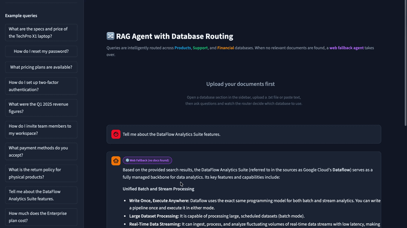
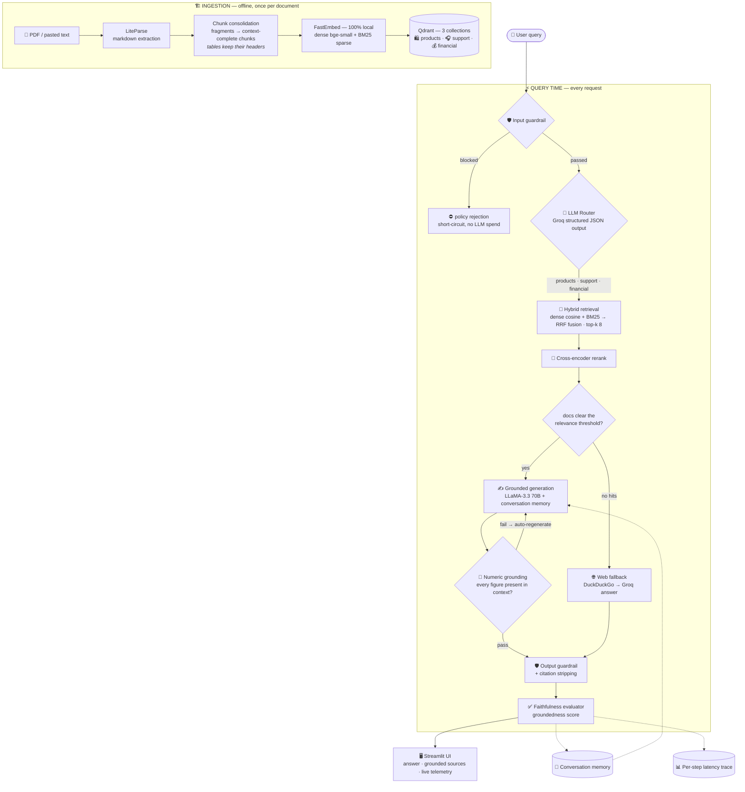
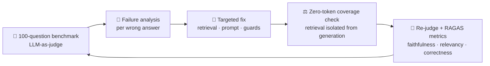

<a id="top"></a>
# RAG Agent with Database Routing

> A production-style RAG system that routes queries across three specialized Qdrant databases (products / support / financial), retrieves with **hybrid dense + BM25 search**, and answers via **Groq** — with guardrails, faithfulness evaluation, memory, telemetry, and a web-search fallback. Built evaluation-first: a 100-question benchmark drove every design change.

**Benchmark headline: 52.7% → 86.7% accuracy (+34 pts) after evidence-based retrieval and prompt fixes** — see [EVALUATION_REPORT_MOD01.md](docs/EVALUATION_REPORT_MOD01.md).

## Demo



## Architecture

Every request flows through six guarded stages, with a web fallback when retrieval clears nothing — and every stage is observable in the UI:



And the system itself is built inside an evaluation flywheel — every improvement below came from this loop, not intuition:



## Features

- **LLM router** with JSON structured output for deterministic database selection
- **Hybrid retrieval**: dense cosine + BM25 sparse vectors fused via RRF
- **Chunk consolidation**: merges parser fragments so tables keep their headers
- **Deterministic answer guards**: numbers must appear in the retrieved context (auto-regenerate), bracketed citations stripped
- **Guardrails** (input/output policy), **faithfulness evaluation**, **conversation memory**, **latency telemetry**
- **Web fallback** via DuckDuckGo when retrieval clears nothing
- **Project workspaces**: create named projects, upload documents per project, switch anytime — chats, telemetry, and vector indexes persist locally (`.projects/`, rebuilt with zero-cost local embeddings)
- 100% local embeddings via FastEmbed — no embedding API cost
- **27 passing unit/integration tests** + resumable, checkpointed evaluation harnesses + CI on every push

## Evaluation-Driven Improvements

The system was benchmarked with 100 LLM-generated QA pairs from an IFRS financial-statements PDF, judged by LLM-as-judge, with retrieval isolated from generation via a zero-token coverage check:

| Change | Effect |
|---|---|
| Baseline (fragmented 102-chunk index, dense-only) | 52.7% accuracy |
| Chunk consolidation (102 fragments → 28 context-complete chunks) | retrieval coverage 70% → 82% |
| Hybrid BM25 + dense RRF, top-k 8 | retrieval coverage → 98% (theoretical ceiling) |
| Exact-value generation prompt + single-value/year-default rules | **86.7% accuracy** |

Remaining failures are analyzed per-question in the [evaluation report](docs/EVALUATION_REPORT_MOD01.md), including two judge errors and two defective benchmark references excluded from aggregates.

## Tech Stack

| Layer | Technology |
|---|---|
| LLM | LLaMA 3.3 70B (`llama-3.3-70b-versatile`) via Groq |
| Judge (eval) | LLaMA 3.1 8B Instant (separate quota pool) |
| Embeddings | Local FastEmbed: `BAAI/bge-small-en-v1.5` (dense) + `Qdrant/bm25` (sparse) |
| Router | Groq Chat Completions with JSON structured output |
| Vector store | Qdrant (in-memory) with named dense + sparse vectors |
| PDF parsing | LiteParse (Markdown engine) |
| Fallback | DuckDuckGo search + Groq generation |
| UI | Streamlit |

## Quick Start

```bash
git clone <repo-url> && cd rag_apps/rag_agent_with_database_routing
cp .env.example .env          # then add your GROQ_API_KEY
uv sync                       # install dependencies
uv run streamlit run app.py   # open http://localhost:8501
```

Requirements: Python 3.10+, a free Groq key from [console.groq.com](https://console.groq.com).

## Running the Benchmark

```bash
# 100-question accuracy benchmark (needs a PDF; pass --pdf or set EVAL_PDF,
# or place it in ./data/9781513563602-mod01.pdf)
uv run python evaluation/evaluate_pdf_module.py --label run1 \
    --judge-model llama-3.1-8b-instant

# Zero-token retrieval coverage check (no API cost)
uv run python evaluation/coverage_check.py

# Tests
uv run python -m pytest tests/ -q
```

Results checkpoint after every question, so runs resume automatically after rate limits.

## Project Structure

```text
rag_agent_with_database_routing/
├── rag_agent/                  # Core system package
│   ├── pipeline.py             # Orchestration: guardrail → route → retrieve → generate → evaluate
│   ├── router.py               # Groq structured-output database router
│   ├── retriever.py            # Hybrid dense+BM25 retrieval with RRF fusion
│   ├── reranker.py             # Cross-encoder reranking of fused candidates
│   ├── databases.py            # Qdrant collections + ingestion (with consolidation)
│   ├── embeddings.py           # FastEmbed dense + sparse embeddings
│   ├── parser.py               # PDF parsing + chunk consolidation
│   ├── postprocess.py          # Citation stripping + numeric-grounding guard
│   ├── guardrails.py           # Input/output safety policies
│   ├── evaluator.py            # Faithfulness (groundedness) evaluation
│   ├── memory.py               # Conversation memory
│   ├── telemetry.py            # Per-step latency traces
│   └── fallback.py             # DuckDuckGo web fallback
├── evaluation/                 # Benchmark & evaluation harnesses
│   ├── evaluate_pdf_module.py  # 100-question LLM-judged benchmark
│   ├── evaluate_ragas.py       # RAGAS metrics (faithfulness, relevancy, correctness)
│   ├── evaluate_papers.py      # Multi-paper routing benchmark
│   ├── coverage_check.py       # Zero-API retrieval coverage comparison
│   ├── fix_failed.py           # Targeted re-answer pass for failures
│   └── rejudge.py              # Re-judge saved results with another judge model
├── tests/                      # 27 unit/integration tests + CI smoke eval
├── docs/                       # Evaluation reports & failure analysis
├── assets/                     # Demo media
├── app.py                      # Streamlit UI
├── .github/workflows/ci.yml    # CI: tests → smoke eval → gated 100-question benchmark
├── Dockerfile / docker-compose.yml
└── pyproject.toml
```

[Back to top](#top)
